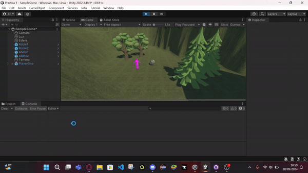

# UnityPositionScript

Este proyecto muestra una escena en Unity con un terreno y varios objetos, incluyendo un **player controlable** y árboles, mientras que un script registra las posiciones de estos objetos en la consola utilizando la propiedad `Transform.position` de Unity.

## Descripción de la escena

La escena está ambientada en un **prado rodeado de montañas altas** y consta de los siguientes elementos:

- **Terreno**: Un terreno principal donde se desarrollan los eventos.
- **4 Árboles**: Dos tipos de árboles que decoran el entorno:
  - 2 **robles**.
  - 2 **abetos**.
- **Esfera con textura de roca**: Una esfera con textura de roca aplicada para darle un aspecto realista.
- **Player**: Un personaje manejable con las teclas **W, A, S, D**, usando el controlador en tercera persona.

Todos estos elementos están distribuidos sobre el terreno, creando un prado rodeado de montañas altas.

## Ejecución

En este GIF se muestra la ejecución del script en la consola, donde las posiciones de los objetos en la escena son registradas:

## Funcionamiento del Script

Este proyecto implementa un script que, al iniciar la escena, itera sobre un conjunto de objetos seleccionados (árboles, esfera con textura de roca, player) y registra sus posiciones en la consola de Unity. Para esto se usa la propiedad `Transform.position` que nos da la posición del objeto en el espacio mundial.

- El script **PositionScript** registra la posición de cada objeto configurado y la imprime en la consola.
- **Propiedad utilizada**: `Transform.position` que obtiene la posición de un objeto en el espacio mundial.

### Propiedad utilizada: Transform.position

Puedes encontrar más información sobre la propiedad `Transform.position` en la [documentación oficial de Unity](https://docs.unity3d.com/ScriptReference/Transform-position.html).